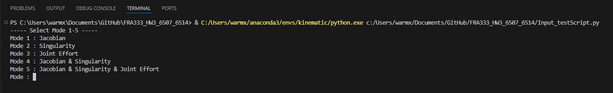
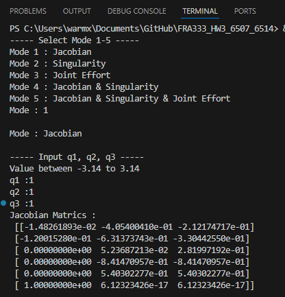
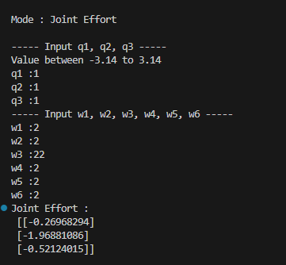

# FRA333_HW3_6507_6514
**จาก HW3 โจทย์ให้หาค่า**
 - Jacobians Matrics
 - Singularity
 - Joint Effort

**รูปภาพของแขนกล**

# Function
โดยมี 3 Function ก็คือ 
- endEffectorJacobianHW3 เป็น Fuction สำหรับการหา Jacobian Matrics จาก Joint Configuration ของแขนกล
- checkSingularityHW3 เป็น Fuction เพื่อเช็คว่าเกิด Singularity หรือไม่ จาก Joint Configuration ของแขนกล
- computeEffortHW3 เป็น Function สำหรับการหา Joint Effort จาก Joint Configuration และ Wrench ที่กระทำต่อ $F_e$

# endEffectorJacobianHW3
โดยการหา Jacobian Matrics จะมีค่าที่ต้องกำหนดคือ
- Input : $q_1$, $q_2$, $q_3$ ซึ่งเป็น ค่าของ Joint Configuration ของแขนกล

และมี Ouput เป็น $J^{6x3}$ หรือก็คือ Endeffector Jacobian Matric 

# checkSingularityHW3
โดยการหา Singfularity จะมีค่าที่ต้องกำหนดคือ
- Input : $q_1$, $q_2$, $q_3$ ซึ่งเป็น ค่าของ Joint Configuration ของแขนกล

และมี Ouput เป็น Flag 
- True เมื่อยุ่ในสสถานะ Singularity 
- False เมื่ออยู่ในสถานะปกติ

โดยจะใช้ค่า Manipulability ของแขนกลมาเปรียบเทียบกับค่า $\varepsilon$
โดย
~~~math
\varepsilon = 0.0001
~~~

และ 
~~~math
m = \det(J_{reduce})
~~~

 แขนกลจะอยุ่ในสถานะ Singularity ก็ต่อเมื่อ 
~~~math
m < \varepsilon
~~~

# computeEffortHW3
โดยการหา Joint Effort จะมีค่าที่ต้องกำหนดคือ
- Input : $q_1$, $q_2$, $q_3$ ซึ่งเป็น ค่าของ Joint Configuration ของแขนกล
- Input : $w_1$, $w_2$, $w_3$, $w_4$, $w_5$, $w_6$ ซึ่งเป็น ค่า Wrench ที่กระทำต่อ $F_e$

และมี Ouput เป็น $\tau^{3x1}$ หรือก็คือ Joint Effort

# How to use
Download หรือ Clone Githb นี้ 
~~~
git clone https://github.com/RunexData/FRA333_HW3_6507_6514.git
~~~

หากต้องการสุ่มค่าให้ Run File ชื่อ
~~~
testScript.py
~~~

หากต้องการ Input ค่าเองให้ Run File ชื่อ 
~~~
Input_testScript.py
~~~

**โดยการ Input ค่าใน Input_testScript.py จะเป็นดังนี้**
เมื่อ Run File แล้วจะให้เลือก Mode 1-5 เป็นดังภาพด้านล่าง

# ตัวอย่าง เลือก Mode 1 : Jacobian

โดยค่าที่ต้อง Input คือ $q_1$, $q_2$, $q_3$ เมื่อ Input ค่าเสร็จ Jacobian Metric จะออกมาดังรูป 

โดยที่ Mode 1-2 และ 4 จะ Input ค่าเหมือนกันเพราะ ไม่จำเป็นต้องมี Wrench เข้ามาคำนวณในการ Jacobian และ Singularity

# ตัวอย่าง เลือก Mode 3 : Joint Effort

โดยค่าที่ต้อง Input คือ $q_1$, $q_2$, $q_3$ และ $w_1$, $w_2$, $w_3$, $w_4$, $w_5$, $w_6$
เมื่อ Input ค่าทั้งหมดเสร็จ Joint Effort จะออกมาดังรูป

โดยที่ Mode 3 และ 5 จะ Input ค่าเหมือนกันเพราะ จำเป็นต้องมีทั้งค่า q และ Wrench เข้ามาคำนวณในการ Joint Effort 

# Reference 
- [The Ultimate Guide to Jacobian Matrices for Robotics](https://automaticaddison.com/the-ultimate-guide-to-jacobian-matrices-for-robotics/)
- [พื้นฐานวิทยาการหุ่นยนต์ : เมตริกซ์จาโคเบียนของแขนกล](https://www.youtube.com/watch?v=exG5zOAm7pA&list=PLHnZZE5j6C65J4-1t-azzmceXevAtWbRf&index=11)

จิรภัทร เขื่อนเพชร 65340500007\
ชวภณ วชิรานิรมิต 65340600014
